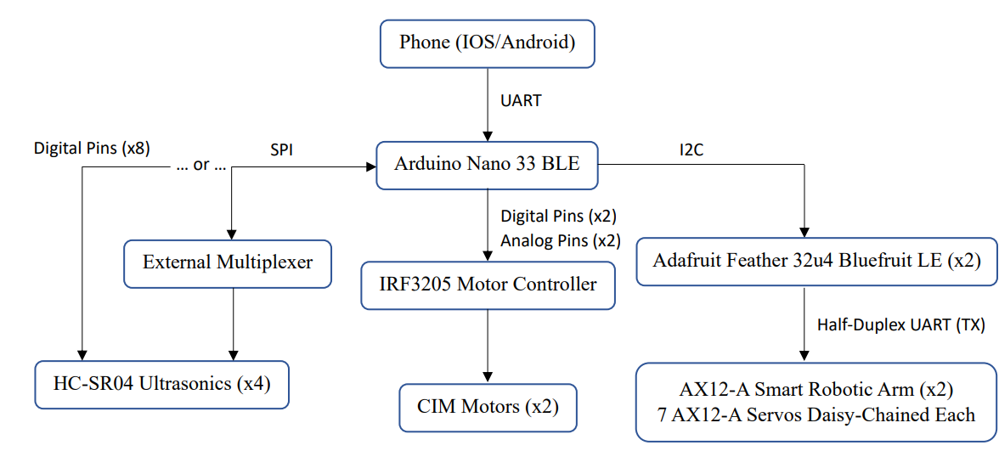

# MrGrabs

 
  

<!-- TOC -->
* [MrGrabs](#mrgrabs)
  * [Inspiration, Purpose and Goals](#inspiration-purpose-and-goals)
  * [What It Does / Overview](#what-it-does--overview)
  * [File Organization / How It's Made](#file-organization--how-its-made)
  * [Challenges Faced](#challenges-faced)
  * [Accomplishments To Be Proud Of](#accomplishments-to-be-proud-of)
  * [Next Steps](#next-steps)

## Inspiration, Purpose and Goals
This project was inspired by a professor's desire to ride around the University of Toronto campus inside and outside buildings on a robot that could wave to students with mechanical arms.

After scaling down the scope of the project to fit within a provided budget of $1000, the primary objective of this project was to build a robot that would complement another research project that involved the use of artificial intelligence for facial and voice recognition on a computer. With this in mind, the robot was designed with a laptop mount, but to further ability to interact with humans, it was also given the capability to navigate through conventional doorways inside buildings of the university campus and to mechanically interact with humans through pre-programmed robotic arm gestures. 

As a secondary objective during construction, the approach of pushing the limits of the quality of the final product with as minimal expense as possible was taken.

## What It Does / Overview
MrGrabs is a medium-sized (16x16x20'') robot, capable of driving through doors with at lest 2' of clearance. It is built primarily out of PLA, with plexiglass and wood used to reinforce the chassis. The robot is controlled via a custom bluetooth APP on an Andriod phone, and integrated with a Microsoft Surface Pro running an application of another project to scan for, greet and wave to students on campus. It also has four HC-SR04 Ultrasonic Sensors that are unused but intended to be a safety feature to prevent collisions.

  
  

### Design Breakdown
Here you can see an overview of the design. The phone connects to the principal controller of the robot (Arduino Nano 33 BLE), which directly manages the motors through the IRF3205. There are also 2 agent controllers, as the Adafruit Feather 32u4 BluefruitLE, that receive simple commands from the principal controller, which are individually used to control the 2 robotic arms, made up of 7 daisy chained AX12-A servos. The Arduino Nano itself is powered by and can recieve data from a mounted laptop, if desired. Lastly, there are HC-SR04 sensors that can be controlled by the Arduino Nano as well to lock up the motors if a collision is imminent.

 
  

- Refer to MrGrabs Pics for more images of the robot

## File Organization / How It's Made

Refer to User Guide for setup and usage information

Refer to Construction Guide for system design information

Refer to ArduinoCode/MainSketches for the code controlling the robot's code written in `C++`

Refer to BluetoothApp for the BLE5.aia file used to configure the andriod app remote controller created through `MIT App Inventor`

Refer to Step and Print files for CAD design and 3D printing files created in `Fusion360`

## Challenges Faced
The major challenge during the construction of the robot was maintaining a low budget while designing the robot’s chassis to support the forces it would experience. Although the original design was entirely 3D printed plastic, additional materials of plexiglass and wood were scavenged and machined to be worked into the robot’s design. The plexiglass was required because the weight of the robot's components would bend the plastic. The wood was required after the original high-density plastic mounts for the castor wheels snapped under both the weight and the torque of the robot starting and stopping motion.

Another challenge faced was the timeline given to develop the robot being 6 weeks. That is 6 weeks to plan the design, 3D model, 3D print, physically acquire, construct, and machine the chassis and its components parts, program multiple on-board controllers in an embedded system, build a remote bluetooth controller app from scratch, do the final stages of testing, making adjustments / deal with setbacks where needed and finally write up the documentation / user guides. Needless to say, the design isn't perfect. The motors were over-engineered and can go much, much faster than the robot needs to under its current weigh of ~30lbs, while the supports for the castor wheels under-engineering and snapped during intitial tests.

Lastly, it should be noted that the robotic arms were taking from a lab that had shelved them, from being outdated. They are at least 10 years old and during operation if the robot moved to quickly while the arms were not stowed, the arms' servos would not be able to hold up their own weight or complete their set path while under external torques. Additionally, with the equipment I had available, I was only able to create a half-dupliex communication line between the Adafruit boards and the robotic arms, to either read current positions or set goal positions. not both at the same time. As such the Adafruit boards had to rely on delays to roughly estimate when a motion would be complete, compounding on the limitations of the robotic arms in the design.

## Accomplishments To Be Proud Of
With this being only my second year of university, this was my first attempt at solo-developing a robot, first time trying to print something this big, first time creating a bluetooth controller app, and many other firsts (granted many thanks are owed to the people who provided me with the resources and advice to make this happen), I believe it's an accomplishment in and of itself to have finished a working design within both the set budget and timeline.

It pleases me to know that 2 years later, the project has not been shelved but been passed on to another research student who is working on extending the chassis in height to make the robot larger and more humanoid and fully integrate the sensors and AI code into the controller for the robot. It is possible that we might see a prototype rolling around the university campus in the summer or a capstone team working on the design, as the project continues to develop towards an interactable lecture attendance keeper.

## Next Steps
1.	It is HIGHLY recommended in the future that for a project of this scale, to allot more than 6 weeks and a single person to work on the project, for the sake of allowing more time to think through the design in its initial phases, different ideas to come up from different people, and minimize oversights.
2.	It is HIGHLY recommended that stronger mounts for castor wheels are designed in any new design iterations of this robot, as that is the robot’s biggest current design weakness and point of failure during operation.
3.	It is HIGHLY recommended that if the design is to be 3D printed again, methods be implemented to reduce the use of supports as much as possible, while taking into consideration the structural integrity of the design. Reducing the use of supports, both reduces the costs spent on materials and reduces the printing time of each piece, which can make the difference between printing 1 piece or 2 pieces in a single day. Talk to the person who is managing the 3D printer you want to use, for ideas.
4.	It is recommended to look into methods of recharging the robot’s 12V and 4V battery, as the Energy Systems Lab currently does not have a battery charger, as of 2023. The professor has stated that using a DC power supply to charge the battery is viable.
5.	It is recommended to invest in a Roborio for both now and all future projects, rather than using Arduino or Adafruit boards, as a Roborio can support several different kinds of I/O at a processing speed much faster than an Arduino/Adafruit board would be able to provide.
6.	It is recommended to swap out the bolts on the bottom of the robot for shorter 1’’ ones to allow for more clearance underneath the robot.
7.	It is recommended to find a different method of wiring hardware parts of the robot together, as to not use cheap/old jumper wires and solder to hold them together under heat shrink.
8.	It is also recommended in future design iterations to allow more time to think about wiring and include design features like hooks to help secure wires down.
9.	It is recommended that if the Ultrasonics Sensors are to be wired up to the Arduino Nano 33 BLE board, that an additional SPI multiplexer chip is used to reduce the number of digital pins used up by the Nano. This is to leave room for potential future additions.

